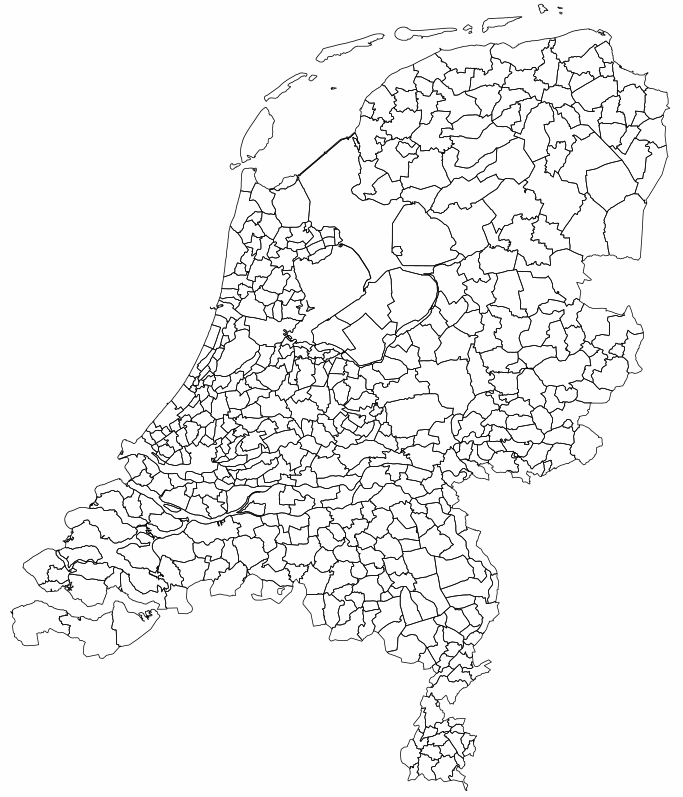
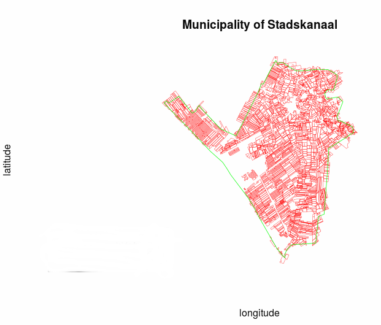

## Outline

<div class="columns-1 centered">

  - The Idea
  - The Process
  - The Result
</div>

# The Idea

## Boer en Bunder
* Check the status of your farmland
* [Boer&Bunder.nl](https://boerenbunder.nl/#b/51.98969,5.653)

## Benchmarking!

- Compare your fields with others

- R 
- HTML5 (Html, javascript & CSS)
- with help of Leaflet & Chart.js

# The Process

## BRP

Basis-Registratie Percelen

- Allmost all farmland in The Netherlands
- Crop types

- <p></p> <div align="center"></div>

## GADM

Global Administrative Areas

- subset per municipalit(y/ies)

- <p></p> <div align="center"></div>


## Intersect

<p></p> <div align="center"></div>

## Intersect

<p></p> <div align="center"></div>

## GADM problem

<p></p> <div align="center"></div>

## NDVI

- [Boer&Bunder.nl](https://boerenbunder.nl/#b/51.98909,5.65284/2015/15/groei)

## Ranking

```
NDVItable #every row has the NDVI values of 2015
cropTypes <- unique(cropTable)
```

> - for loop over all the `cropTypes` with index `i`
> - for loop over every date with index `j`

```
fieldIndex <- which(cropTable == cropTypes[i],)
tempNDVItable <- NDVItable[fieldIndex][,j]

tempRank <- rank(tempNDVItable),ties.method="first")/length(tempNDVItable)
rankMatrix[fieldIndex,j] <- tempRank
```

## Exporting

- Fields stored as GeoJSON
- ranks  stored as JSON
- ndvi   stored as JSON

# The Result

## Webpage

[NDVI Benchmark Stadskanaal](http://gerts.github.io/NDVICropBenchmark/html/)